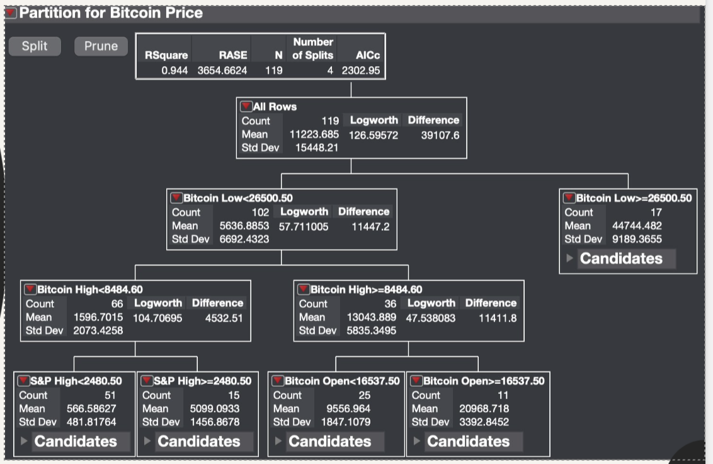
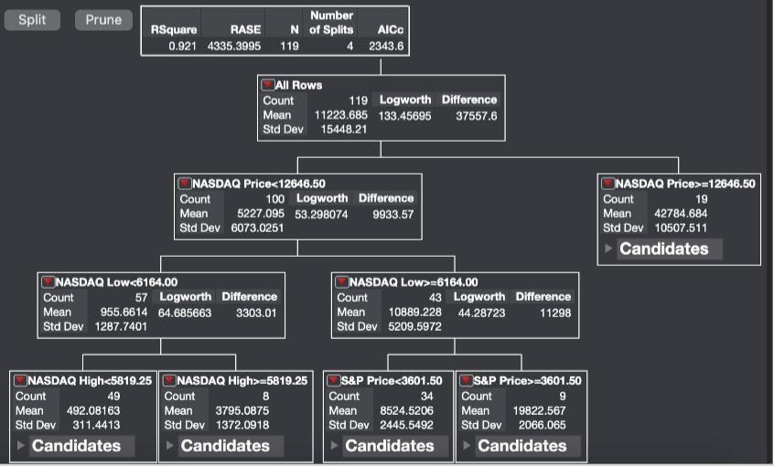

# About Me
My name is Raiyyan Ahmed. I'm a first-generation college graduate from the University of St Thomas with a Bachelor's degree in Computer Science. I love to play video like Elden Ring and Fire Emblem because of the challenge they offer. You should hire me for my skills in Python and Java, but I can always learn whatever is required to complete a task.

# Skills
- Java
- Python
- Database Design
- Adaptability

# Projects

## Work Out Tracker
[Link to Site: IronLung](https://ironlog-iiyu.onrender.com/)

In a group, we had to create a database and implement it into a website. We decided to create a website to help track your workouts, My portion of the project was designing the database and having it connect to a Neon server. Claude was used to help create the front end and help connecting the database to the server

## Games
[St Thomas Sustainability Game](https://sp26-sust-init.onrender.com/Game1/index.html)

Games were created for community partner during my Capstone CS course. The partner would tell us what they wanted, in this case, to create video games version of some of their activities. Because we had limited game design/creation knowledge, we had to figure out how we would create it. This lead us to try GameMaker, but ended up going to Phaser to create the last 2 games. I was the main person working on the GameMaker (Trash Sort), having to learn the GameMaker language to use it.

## Statistic Project

For my machine learning statistics course, there was a group project about implementing what we learned into a topic we wanted. The group ended up choosing to predict the price of Bitcoin based on the S&P, DowJones, and Nasdaq. My portion was using decision trees to try to find which factors are the best indicators. The biggest issue in this project was the collaboration with one of the group members. We split the work by what we felt most comfortable with, but didn't check in as often as we should've. This lead to work being doubled up and the project falling behind. This showed me how important check-ins for projects are.

## Mini Psychology Research Paper
[Pyschology Paper About Phobias](showcase/PsychologyPaper.pdf)

I had to do a mini research paper about a topic we learned in my Psychology class. I was given two weeks to find other papers to gain information, and then write the paper. I planned it out where the first week was research and taking notes, while the second week was writing the paper. This was the third paper for the class, and by properly pacing the work, it was the paper I recieved the best score on.

## Film Analysis
[Parasite Movie Analysis](showcase/ParasiteEssay.pdf)

I do like to watch movies, but usually don't analyize them too deeply. So during a film course I took, it required me to dig deeper into films than I normally do. I had to connect things I saw in the film's runtime to other scenes or connect to real world information I found regarding culture.

# Resume
[My Resume](showcase/Resume.pdf)
